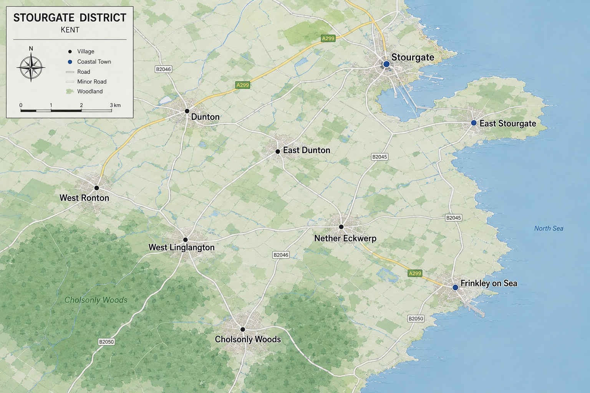

Everything you need to know about Stourgate, the jewel of East Kent, assuming the jewel had been left in a drawer for several centuries and nobody had bothered to clean it.

**Medieval Stourgate**

Medieval map of Stourgate.

Stourgate was founded in the 8th century by fishermen.

The town's medieval charter, granted in 1147, entitled Stourgate to hold a market, hang criminals from the old sea wall, and refer to itself as a "gate".

Stourgate Castle stood on the site of what is now the Betfred on the High Street until it was demolished in 1603 following what local historians describe only as "the incident." Retiring Cardinal Alfonso Ricci maintains there is still a portal to hell directly behind the shop.

**Kent Historical Society Podcast, Episode 114**
Guest: Dr Arthur Pendelton, author of *Dark Waters: A History of the Stourgate District*

"People round here think Stourgate's just marshland and a few old villages. Spend five minutes with that 14th-century map we keep locked up at the regional library and you'll change your mind. Seven hundred years of the place being an absolute magnet for misery.

Start with the map itself. Nether Eckwerp, Eccwêrpa Inferiôr in the old Latin, got hit so badly by the plague in 1349 that the bailiffs walled up the cottages with the sick still inside and burned the lot. By the 1580s you've got the witch trials, and the magistrate running them was enough of a fanatic that he used the actual map during interrogations, branded a scorch mark clean through the middle of it, claimed it would sever the road to the coast so the mob couldn't march women out to the pyres.

It doesn't let up. 1685, a judge sets up a bloody assize in the castle ruins after Monmouth's lot, hangs farmhands along the coast road and leaves them up in gibbets for years. The smuggling gang running Cholsonly Woods in the 1740s ambushed a squad of customs men and put them in the peat bogs. Even the Victorians managed it, a lead mine near Nether Eckwerp flooded in 1871, trapped eighty men, and the owners sealed the shafts rather than dig them out to protect the railway line. Twenty years after that the asylum built over the old plague site had a sewage failure and lost nearly every patient to cholera inside three weeks.

Then you get to the 1930s, and this is where it gets a bit more sensitive."

*[Pendelton pauses here. Worth noting, listeners, that his book spends considerably longer on this period than the interview time allowed.]*

"There was a local group, called themselves the Stourgate Legion. Pendelton's line on them is that they were 'misunderstood traditionalists,' which is one way of putting it, given they were flying German flags out past what's now Frinkley-on-Sea and signalling passing aircraft. Whatever they thought they were doing, it got the attention of Himmler's Ahnenerbe outfit, who took an interest in a crest on the map Pendelton reckons marks an old Saxon ley line. When the war ended, the material got confiscated, Himmler's files on it were classified by the War Office in 1945, and the Ministry of Defence has never released what's apparently called the Stourgate Dossier. Pendelton is convinced this proves something. Nobody else at the Historical Society seems entirely sure what.

Even after the war it doesn't stop. A defence contractor buried barrels of surplus nerve agent in the old quarries near West Linglangton in the sixties, and there's been unexplained blight out there ever since. These days we've got the Stourgate Sands Caravan Park sitting on top of the old mine drainage, and a Tesco Express built, according to the Facebook groups, directly over the 1894 cholera ward. Half the night staff have apparently already asked for a transfer over what they're calling 'unexplained drafts in the bakery aisle.'

So there's your scorch mark on the old map. Plague, witch trials, Nazi sympathisers convinced they were onto something ancient, and now a meal deal on top of a plague pit. The place just keeps finding new ways to do it."

**Modern Stourgate**

Top class modern map of Stourgate.

Today Stourgate is home to just over twenty four thousand people, one marina, one pier, one bypass that has been under review for twenty consecutive years, and one football club.

The town's economy is built primarily on the market, the frilly decorative edge trade. Stourgate was recently named the 476th best seaside town to visit in Kent, a ranking the Bugle considers an improvement.

The seafront remains the town's principal attraction, along with the Marina and Roy's Sex Boutique.

**Surrounding Areas**

Just inland lies Dunton, best known for its industrial estate.

Cholsonly Woods, and the small village of the same name beside it, sit further out and are currently the subject of a Kent Police investigation the council has described as "ongoing" and the Woods coffee shop has described as "a lot busier than usual."

Further afield are West Ronton, Nether Eckwerp, birthplace of one of the dancers from Top of the Pops, West Linglangton, home of Kent's best annual psychic fest, and Frinkley on Sea, the less said about there the better
**Twinning**

Stourgate is officially twinned with a small town in Belgium . Talks to establish a second twinning arrangement with a town in France collapsed in 2019 after the French delegation left early and did not respond to further correspondence.

**Local Legends**

**Coat of Arms**

The town's coat of arms depicts a herring, a set of bed valances, and a Latin motto which translates roughly as "we are also reviewing this."

