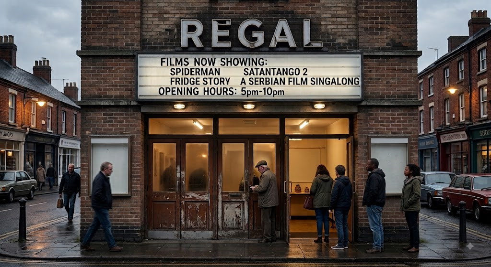
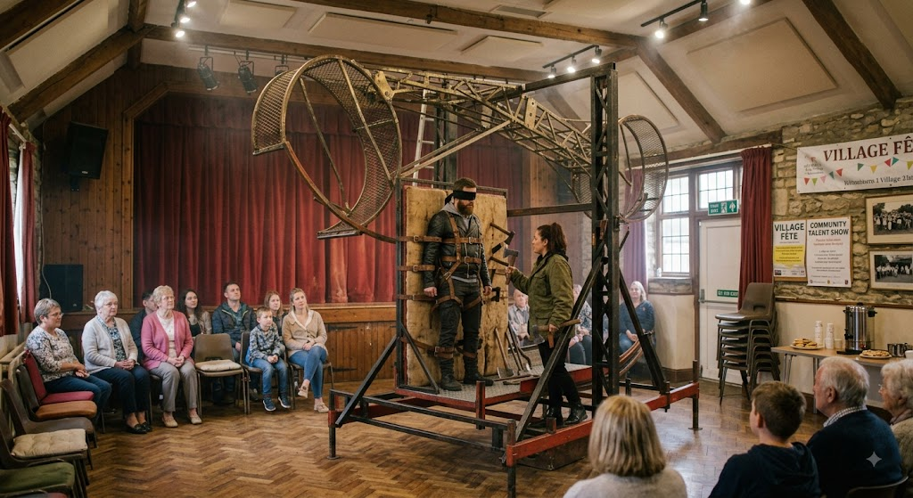
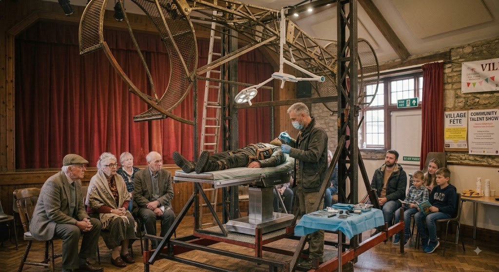
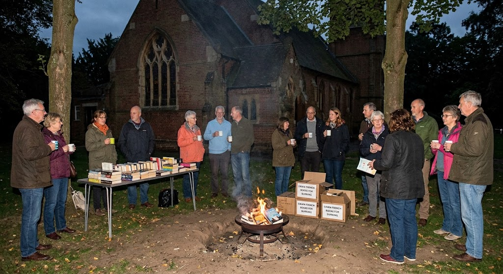

Listing for all local events.

**MUSIC**
Acoustic duo **Meg and Pong** play hits from 70s Chilean folk songs,  Friday, September 18th, Stourgate Superdome. **£175-£386**. Sold out.

Come join us at **Stourgate Village Hall live music** on Friday, September 18th. Oasis, provided they don't demand surge pricing (we're negotiating), in which case Bruce Springsteen will step in to take the slot. The rest of the  bill features opening sets from Simon & Garfunkel, System of a Down, an exclusive reunion set from Pink Floyd featuring Roger Waters, and a brief acoustic set from T. Swift. Doors open at 7:00 PM, parking is limited, and tea, squash, and cakes will be provided by the Parish Committee in the foyer. **£8.50, or two for £9**.

**Dunton Church choir Covers CD release party**. Dunton Church Friday, September 18th. Come see us sing our new CD of classic covers, all proceeds go to the church roof fund. CD can be bought for £8.50 from the village hall, track listing: 1. Bridge Over Troubled Water, 2. Hallelujah, 3. You've Got a Friend, 4. Lean on Me, 5. God Only Knows, 6. Fix You, 7. Sound of Silence, 8. Fields of Gold, 9. Make You Feel My Love, and 10. Nazi Punks Fuck Off.

**CINEMA**

Waste some time here.

**Stourgate Regal Cinema showtimes**

**Tam Tam Abamtamtam Bollywood** film starring Maheep Kapoor as a disgraced chair fighter. 3h 57m. Due to long running time customers in the second showing will have to sit though the last 57 minutes of the first.

**Tam Tam Abamtamtom** Polish film starring Zbigniee Wildarsky as a ditch digger. 2 h 7m. 

**Spiderman A Brave New World** half man half spider terrorises New York. 2h 25m

**A Serbian Film sing along**. Fun for all the family. Fancy dress prizes. 1h 50m.

**Satantango 2** residents of a Hungarian farm collective go on holiday to Skegness 7h 19m

**Love Teeth** romantic comedy in which a marine biologist and the man eating great white shark she is hunting fall in love. Based on a true story. 1h1m.

**Fridge Story** who knew that when we're out of the room our fridges come to life. (Younger children may find the scene where a chest freezer commits suicide due to desperate loneliness distressing). 1h33m.

**CLUBS**

**Bear** baiting with all new bears every Friday 7pm, Dog and Crown, Dunton, **£8.50**.

**Racist Club**, The Old Duck, every Friday 7pm. Come moan about foreigners and non-white people. **Free**.

**Stourgate Blindfolded Wheel of Death Trick Club** Are you looking to push your **thrill-seeking limits** to absolute extremes? Join the Stourgate Blindfolded Wheel of Death Trick Club, where complete beginners can learn the precise, heart-stopping art of tossing razor-sharp axes at a rapidly spinning target while wearing a thick velvet blindfold. Stourgate Village Hall,  every Friday 7pm. **£8.50**.

Deardre Allens practicing with the late John Rogers.

**Stourgate Beginners Trauma Surgery Practice Club**, where members can gain hands-on experience in emergency field medicine, rapid tourniquet application, and urgent blood-loss management in a fast-paced, highly practical environment. Stourgate Village Hall,  every Friday 7:15pm. **£8.50**.

Emergency surgery at the village hall.

**Kids Torture Enthusiasts**. Stourgate Nursery, 3pm every day except Christmas. Get your kids into torture at an early age. We have our own thumbscrews and a rack. **Free**.

**Burn a Book Jamboree** - bring a book to burn or help us to burn our collection of Dawn French books. Friday, September 18th, West Ronton Church. **Free**.

Come join us to repress free speech especially Dawn French's.

**ART AND CRAFT**

**Build your own** spoon. Eighteen week course at Dunton Craft Village. Wednesdays at 6pm, start December 25th. **£0.12p** per week.

**Build your own** mausoleum. Three week course at Dunton Craft Village. Wednesdays at 5pm, start July 4th. **£11.12p** per week.

Carpet **Art show**. Everyday from 9 to 5 at Stourgate Carpet World. See local artists carpets including Axminsters. The art can be purchased and fitted by our experienced art fitters. Show **free**, extra costs for underlay, grippers, berber etc. 

**Build your own** working air craft carrier. 90,000 week course at Dunton Craft Village. Wednesdays at 4pm, start October 8th. **£100,000.12p** per week. Discount for ex armed forces.

