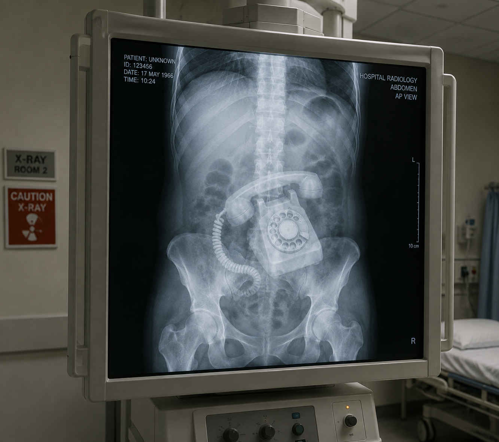

On Tuesday morning Maggie Hawkins and Dave Boulder were stood outside Stourgate NHS trust. They have been there for a whole week protesting the hospital's decision to close its x-ray department. 
"If we don't stand up for this, who will?" said Maggie.

A spokesman for the hospital, Dave Pearson said that the reason the x-ray department was closed was that there was a bomb made of adantium inside and Spider-Man said radiation could cause it to explode. 

An XRay machine in happier times.

"That's absolute nonsense," said Maggie."Bombs made of adantium are hardly likely to end up in Stourgate x-ray department. In fact, the last time there was one here, it was in the canteen miles away from the X-ray machines." Maggie, an unemployed lesbian layabout  was cautioned by a police constable, Dave Jennings when she tried to stop hospital staff from entering the building by hitting them around their head with her placard.

PC Dave Jennings opposite of fighting the law and it won by him. Or something.

Her fellow protester Dave Boulder was arrested for parking longer than he'd paid for. A spokesman for the hospital said they were clearly marked time limits and fee structures and Dave had exceeded his time by over 15 minutes. Normally the police turn a blind eye to such minor infractions and our reporter Wade Jensen asked them why Dave was arrested. Constable Jennings refused to comment. Later, East Kent Police issued a statement saying that Mr. Boulder had committed an offence under the Hospital Parking Act, 1998 section 7 which allows for the increase of a standard parking offence to the offence of aggravated parking under certain conditions one of them being "the accused is a bit of a knob head".