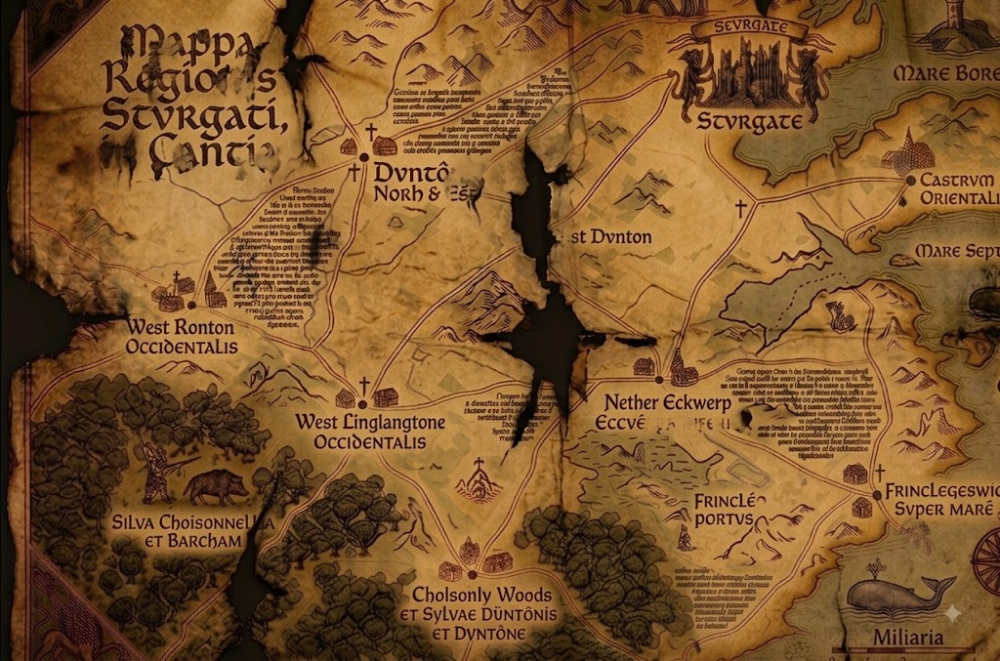
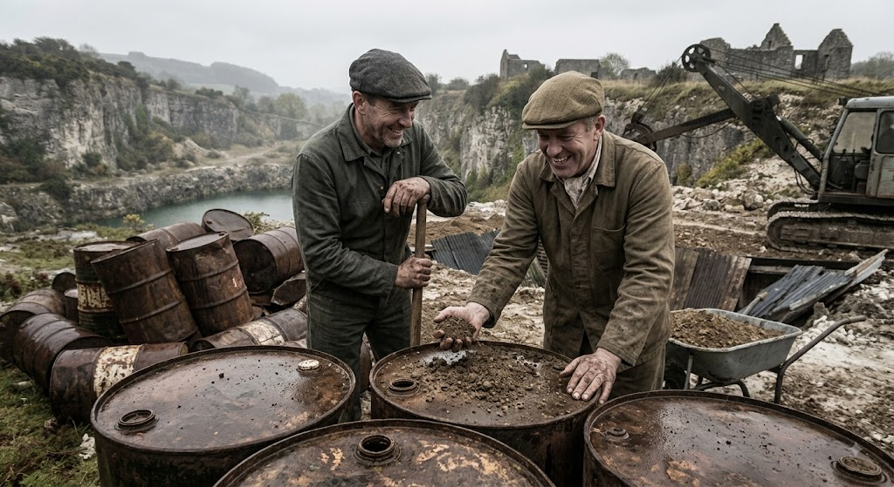
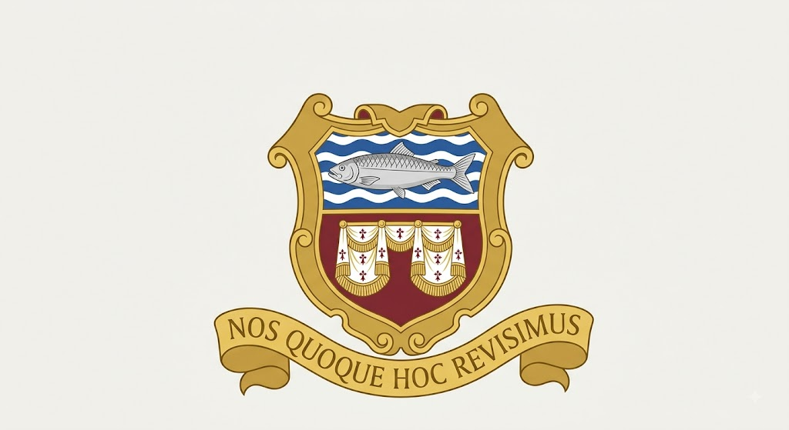
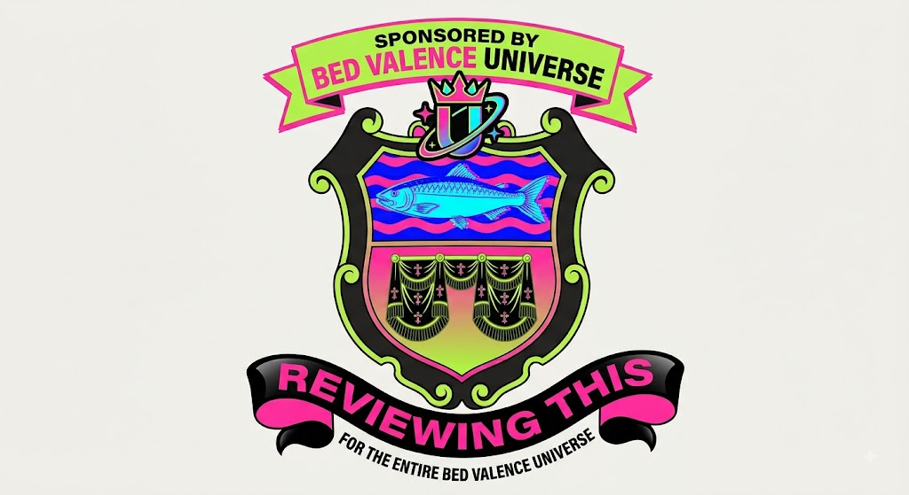

Everything you need to know about Stourgate, the jewel of East Kent (this is just the editor's opinion and Bugle Newspapers and Towels Ltd make no representation, warranty, or guarantee, express or implied, as to the accuracy of the above, and accept no liability for any loss, damage, disappointment arising from a visit made on the strength of it).

**Medieval Stourgate**

Medieval map of Stourgate. Text enhanced by Map Bettering AI&trade;

Stourgate was founded in the 8th century by fishermen.

The town's medieval charter, granted in 1147, entitled Stourgate to hold a market, hang criminals from the old sea wall, and refer to itself as a "gate".

Stourgate Castle stood on the site of what is now the Tesco Express on the High Street until it was demolished in 1603 following a goose tax dispute.

The map of Stourgate above dates from 1322 and was created for Baron Roger DeBlood a Norman Lord. DeBlood owned most of the land around Stourgate which he rented to tenants. He was extremely cruel to his tentants demanding high rents and calling several of them ugly and sometimes fat. He also organised a Friday parade where the tenents were forced to walk through the streets of Stourgate dressed in medieval cowboy, contruction worker and other outfits and sing the medieval hymn Iuventus Mystica Christi Adunatio. Many ttttteennaients left the village after the shame of singing, *Scis te ire velle ad IMCA*.
\
The map and the wider history of Stourgate are discussed in...

**Kent Historical Society Podcast, Episode 114**
Guest: Dr Arthur Pendelton, author of *Dark Waters: A History of the Stourgate District*

Most people, when you mention Stourgate, think of the sea, marshland and a few unremarkable villages, and I suppose on the surface that's fair enough. But below the surface (about 5 inches) a rather different picture emerges. Seven hundred years of fairly relentless calamity and horror.

Take the map itself. Nether Eckwerp, Eccwêrpa Inferiôr in the original Latin, was hit so badly by the plague in 1349 that the bailiffs walled up the affected cottages with the occupants still inside and burned the row. Then in the 1580s you get the witch trials, and the magistrate who presided over those used the map during interrogations, branded a scorch mark straight through the centre of it, believing that this would sever the road to the coast and stop the mob marching the accused out to the pyre. So it was a kindness in his eyes.

There's a bloody assize convened in the castle ruins in 1685, after the Monmouth rebellion, farmhands left hanging in gibbets along the coast road for years. The smuggling operation working out of Cholsonly Woods in the 1740s ambushed a squad of customs officers and put them in the peat bogs. Even the Victorians managed to add to the tally, a lead mine near Nether Eckwerp flooded in 1871, trapped eighty men, and the owners chose not to dig them out because it would have disturbed the railway embankment. About twenty years after that the asylum built on the old plague ground had a sewage failure and lost nearly the whole patient population to cholera inside a fortnight.

In the 1930s there was a local group, called themselves the Stourgate Legion. I tend to think they've been painted as rather more extreme than the record actually supports, though I grant you flying German colours out past what's now Frinkley-on-Sea and signalling passing aircraft doesn't help their case much. Their meeting house kept a map with a crest on it that I've argued, in print, marks a genuine Saxon ley line, and it was that map that caught the attention of Himmler's Ahnenerbe people. When the war ended, the map and the Legion's own papers were confiscated. Himmler's files on the subject were classified by the War Office in 1945, and the Ministry of Defence still won't release what's apparently called the Stourgate Dossier internally.

It doesn't stop with the war, either. A defence contractor buried barrels of surplus nerve agent in the disused quarries near West Linglangton sometime in the sixties, and there's still unexplained blight on that land.

Burying barrels of surplus nerve agent for fun.

These days you've got the Stourgate Sands Caravan Park sitting right on top of the old mine drainage, and a Tesco Express. So it's not all doom and gloom.

**Modern Stourgate**
Today Stourgate is home to just over twenty four thousand people, one marina, one pier, one football club, and a large pile of gravel.

The town's economy is built primarily on the market and the frilly decorative edge trade. Stourgate was recently named the 476th best seaside town to visit in Kent.

The seafront remains the town's principal attraction, along with the Marina and Roy's Sex Boutique.

**Surrounding Areas**
Just inland lies Dunton, best known for its industrial estate.

Cholsonly Woods, and the small village of the same name beside it, sit further out and are currently the holders of world's longest continous Police investigation which began in 1974.

Further afield are West Ronton, Nether Eckwerp, birthplace of one of the dancers from Top of the Pops, West Linglangton, home of Kent's best annual psychic fest, and Frinkley on Sea, no comment.

**Twinning**
Stourgate is officially twinned with a small town in Belgium, Brussels. Talks to establish a second twinning arrangement with a town in France collapsed in 2015 after the French delegation left early and did not respond to further correspondence.

**Local Legends**
[placeholder]

**Coat of Arms**
The town's coat of arms depicts a herring, a set of bed valances, and a Latin motto which translates roughly as "we are also reviewing this."

Stourgate's coat of arms is a bit rubbish.

In 1993 the town's badge was controversially rebranded with the fiancial assistance of a local business.

Stourgate's coat of arms a much better version.

