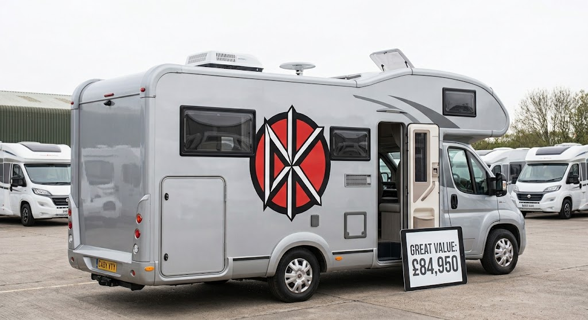
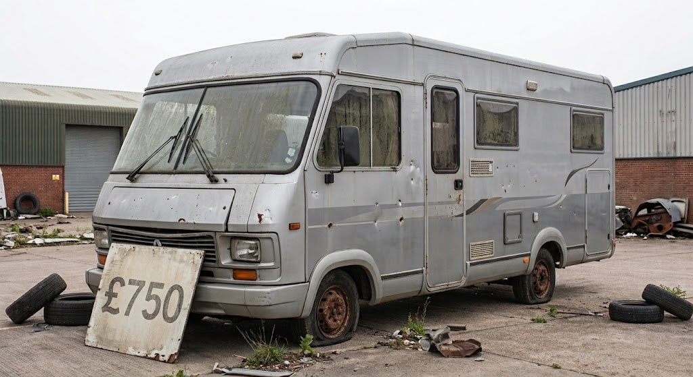

Dunton Motorhomes is offering Stourgate Town supporters a discount on all new and used motorhomes this month, as part of a new partnership with the club.

The dealership, based just outside Dunton, is owned and run by Helen Saunders, who also sits on Stourgate Parish Council.

 The forecourt has traded from the same site on the Dunton Industrial Estate for eleven years and currently carries around forty motorhomes across new and used stock, ranging from small campervan conversions to full six-berth models. Ms Saunders said the offer was a way of giving something back to the town. "I might be based in Dunton but Stourgate is where my heart is," she said.

Motorhome sales lady.

Among the new arrivals is the Solara Trekmaster Dead Kennedys Special Edition, priced at £84,950, which features a slide. Ms Saunders said the model had already attracted interest since arriving on the forecourt.

This special edition will sell out soon.

Sylish and functional interior, optional olympic size swimming pool available.

At the other end of the range is a 1994 project vehicle, currently priced at £750 and sold as seen. Ms Saunders said it would suit a buyer looking for a bargain.

Project motorhome priced at £750.

Customers who buy a motorhome this month will also receive a free "We Hate Helman" flag, produced in partnership with the Stourgate Town Supporters Club.

*Editor's note: this article was written and scheduled for publication prior to Mr Helman's untimely decapitation. The dealership has confirmed the flags remain available while stocks last.*
