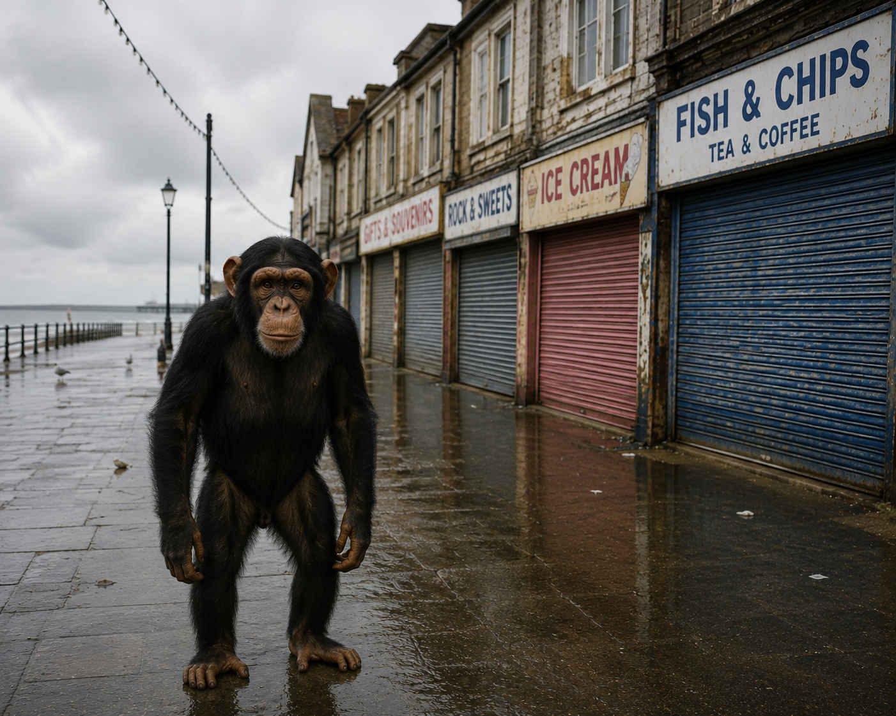

Chimpanzees are an endangered species and Stourgate Council rejected a resoluton that could not only have saved the species but also all life on earth. At least that is according to cllr. Barry Heptfleck who proposed Bill 44-A, 2026 also know as The Chimp Bill.

Stourgate Town Council voted 6-1 on Tuesday to reject The Chimp Bill. The bill mandated replacing 'chimpanzee' with 'himpanzee' in all council communications. 

A chimp yesterday.

Heptfleck said 'My fellow councillors, by rejecting this you have brought disgrace to Stourgate. Future generations will weep when they see what might have been. I curse you and your offspring for all eternity.'

Council leader, Marjorie Atkins said 'Don't be a spazz.' The meeting was then ajourned.
