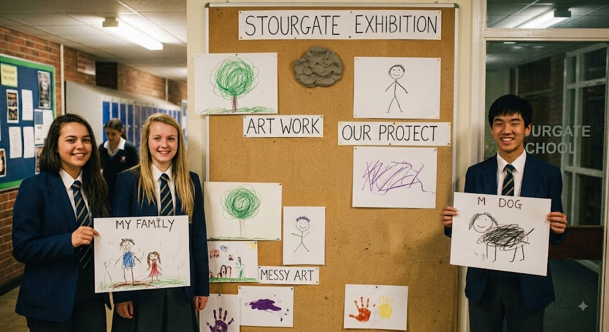
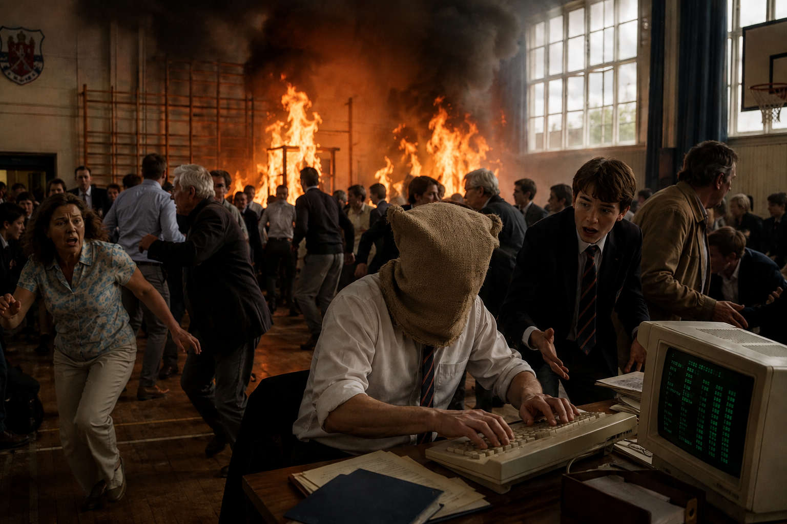

Stourgate Grammar School has reported its best exam results in a decade.

Headmaster Roy Bobby, who took charge of this year's results day after the retirement of the previous head of upper school, admits the term did not begin well. Mr Bobby had grown to dread results day ever since a former colleague, Ms Karen Voss, left the profession abruptly some years ago following a dispute over marking boundaries.

Every August, Stourgate Grammar competes informally with Dunton College, the private school across the estuary, to see whose results make the better headline. This year Mr Bobby was assigned an assistant, Terry Poppins, the nephew of the outgoing head and, by his own admission, not what most people would picture when they think of an exams officer.

While collecting a new photocopier toner cartridge with Mr Poppins, Mr Bobby ran into his old rival from teacher training college, Gordon Ashworth, who now oversees results at Dunton. Keen not to look like the poorer school, Mr Bobby let slip that Oxford's admissions office was sending someone down to personally verify Stourgate's grades, on account of how remarkable they were. This was not true. Mr Poppins overheard the claim and, delighted, repeated it to a reporter from a regional radio station before Mr Bobby could stop him.

Word spread quickly. By the following morning the story had grown to include a rumour that a university delegation from Hollywood would tour the school in person, and parents began asking when the visit would take place. Mr Bobby, unable to walk the claim back without looking foolish, decided to let it run and hope for the best.

Stourgate's actual results, while an improvement, were nothing like as remarkable as the story suggested. Mr Poppins, unbothered by this, threw himself into organising a small exhibition of the pupils' coursework for the supposed visit, on the theory that if nobody from Oxford turned up at least the corridor would look nice.

Six formers showing off their top art.

Mr Bobby made several attempts to contact someone, anyone, at Oxford to make the story true after the fact, eventually driving to the university on a Tuesday to explain himself in person. He was seen by a junior administrator in the car park, who confirmed there was no such verification scheme and had never heard of Stourgate Grammar School. He also tried to persuade his ex girlfriend who was Vice Chancellor of the univeristy but she refused.

With the local paper still running the story and governors asking questions, the school's chair of governors discovered there had been no university involvement at all and ordered the exhibition cancelled, telling Mr Bobby to consider his position and dismissing Mr Poppins on the spot. Mr Bobby, frustrated, said several things to Mr Poppins he later regretted, before deciding, on reflection, that the exhibition should go ahead regardless of what anyone from the governing body thought.

The two made up, the "cancelled" signs came down from the noticeboard, and the exhibition opened as planned in the school hall to an audience of parents and a photographer from the paper. Midway through, Mr Ashworth arrived from Dunton to announce loudly that there was no Oxford verification and the whole thing had been invented. At that exact moment a car alarm went off in the car park, which Mr Poppins insisted was the delegation's driver arriving. He then distracted from this lie by setting fire to the school gym. Everyone was to busy avoiding being burnt to death and completely forgot about the visit.

Mr Bobby saving the day.

However there was still the issue of the school boasting outstanding grades so Mr Bobby saved the day by using a computer to change the pupils grades like in Wargames.
