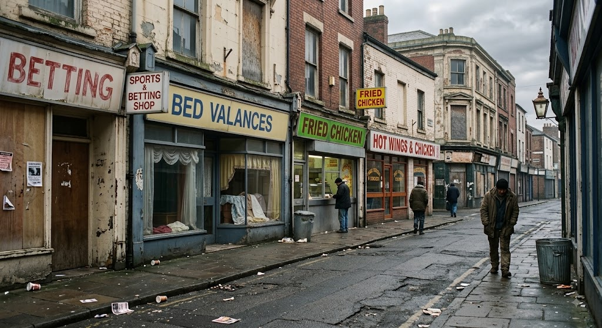
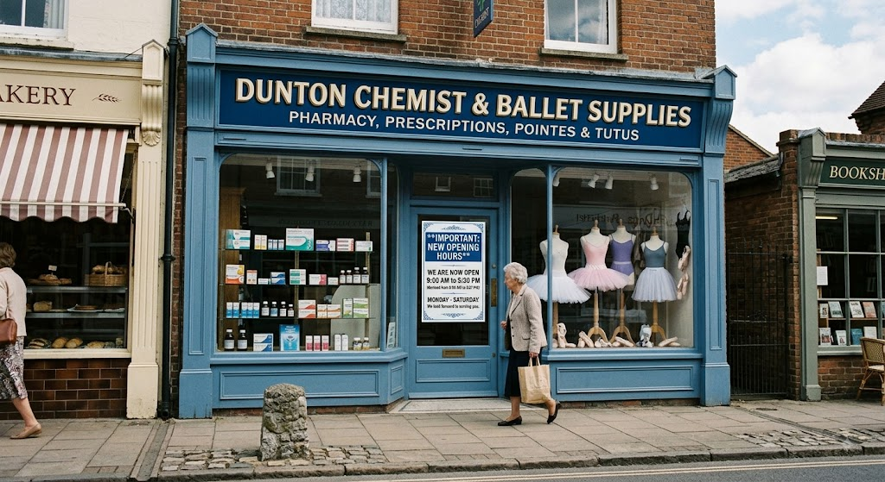
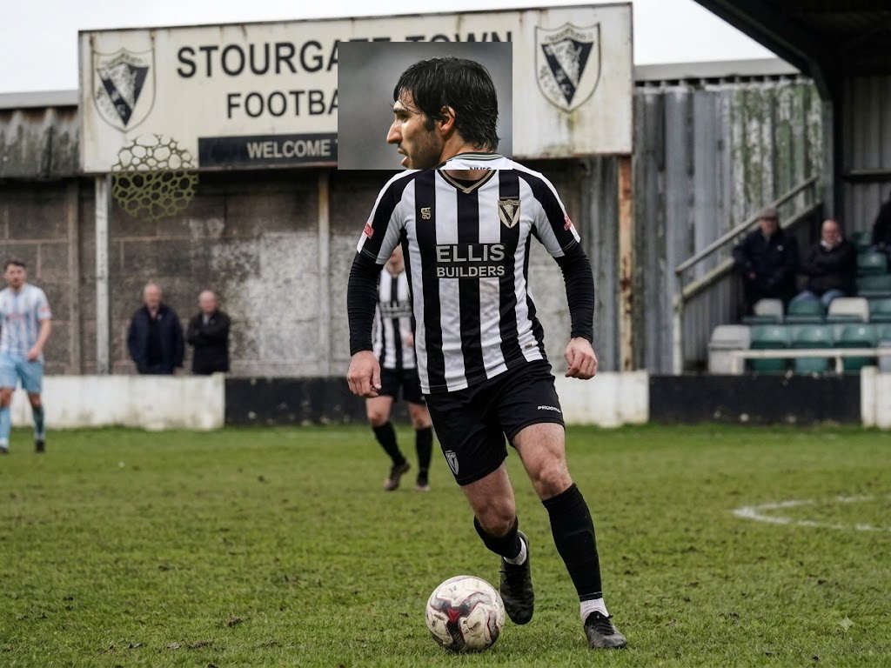

**Bin collection** delayed by one day due to bank holiday. 

**Market**'s Tuesday pitch count rises to nineteen stalls. A new stall selling bed valences was added this week.

**Dog seen on seafront** for third day running, no owner identified. Witnesses claim it looked like a dog. The RSPCA have installed their top marksman in a hide in the Marina.

**Stourgate one of seven gates of hell.** Retiring Cardinal Alfonso Ricci says there is a portal to hell behind Betfred in the High Street.

Stourgate High Street during last year's carnival.

**Found**: Packet of tissues at La Cucuracha Mexican restaurant. Write to the Bugle describing them to claim.

**Fly tipping** The Council have involved East Kent Police in an investigation into fly-tipping in Cholsonly Woods. A mass grave with several hundred bodies and thousands of body parts was uncovered by a Woods coffee shop volunteer last week.

**Darth Vader to visit Stourgate**. Darth Vader has commanded his top scientists to create a time machine/interstellar vehicle and he aims to visit Stourgate in it in November.

**Stourgate is best.**  Stourgate named as #476 best seaside town to visit in Kent by the Good Seaside town to Visit Guide.

**Council review**. Dunton Council are reviewing the use of cheese in future road repairs. 
chemist

All sorts of upheaval at the chemist.

**Chemist opening hours.** Dunton Chemist and Ballet Supplies to open 9 to 5:30pm instead of 9 to 5:27pm.

**Stourgate Town signing.** Stourgate Town have signed Tonali from Spurs, fee believed to be £130M. The Italian only spent 3 weeks playing for Tottenham.

Tonali debut in East Kent Roller Blinds Second Division game.

