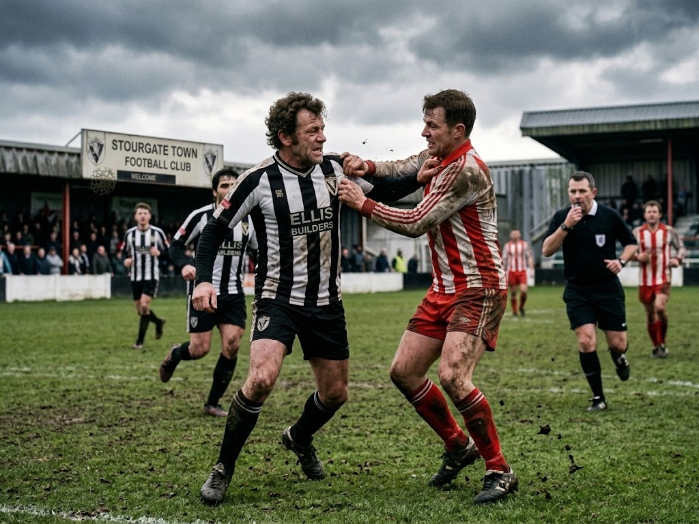
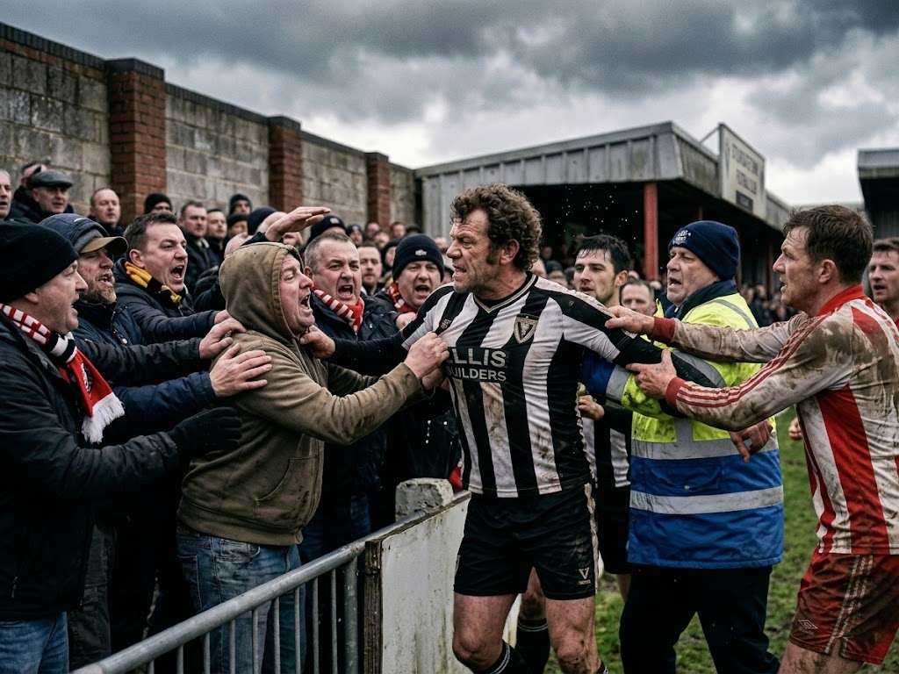
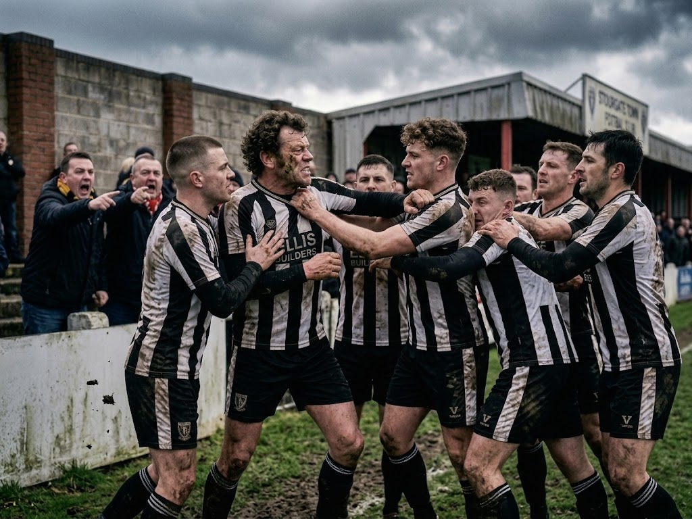
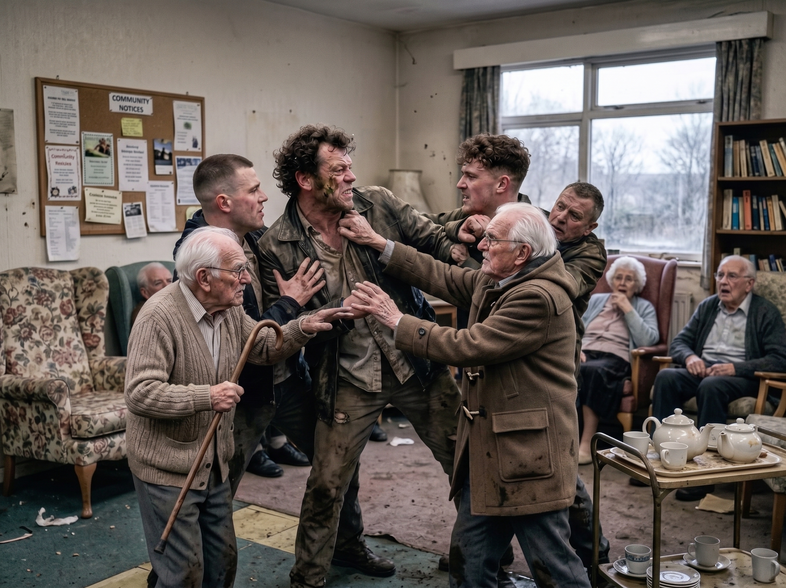

**Town's longest serving player**
When Ray Barnes first played for Town the Queen was still the Queen and not dead and Morecambe and Wise were the number one TV show. He is Town's longest serving and - some would say - most average player. We spoke to Ray at a recent trining session at The Warren.

Ray signed as a schoolboy even though he had dropped out of school to be a drugs runner like in Top Boy. He soon realised he couldn't keep playing football and sell drugs for a living so he stopped playing for a year. But his life was changed by Town's manager at the time, Christian do-gooder Benny Hills. 

Ray bossing midfield.

'Benny was a great bloke. He told me I would be first on his team sheet if only I gave up the drug dealing. He kept going on about Jesus and just to stop him I decided to give up the drug life and concentrate on my football,' said Ray. 'By the power of the Lord Jesus on and on he went. A great bloke but I must admit it was a bit of a relief when his body was found in that lake submerged with a number of 7 to 15kg weights tied around him. Great bloke mind. It was around that time I got into weight training and I really bulked myself up which you need to be muscly and all at this level of football.' 

Ray getting the crowd onside.

Ray played every game for Town for a seven year period. 'It were great back then we had such a laugh. I remember when Stubbsy [Town forward David Stubbs] was worried about his wife driving his new car. We got one of my mates to dress up as a copper and he came into the dressing room and said to Stubbsy his wife had crashed and been killed. You should have seen his face!' laughs Ray.
'Another time we put rat poison in Banksy's [former useless Town manager, Jim Banks] sandwiches. He were on life support for a week. Cracked us up.'

Ray organising Stourgate's midfield.

We asked him if he had any regrets. 'Not really I mean I had a great time and all. Although I wish I'd got Helman back.' Steve Helman's wild tackle had badly injured Ray in a league cup match in 1992. 'I couldn't play for a year after that tackle. Bastard. I'd forgotten about that. I'm gonna get that \*\*\*\*ing \*\*\*\*.'

Loyal son Ray visiting his dad in a care home.

And with a twinkle in his eye Ray left us to go back to training, Town's longest serving player always ready to put in the hard work that made him so average.